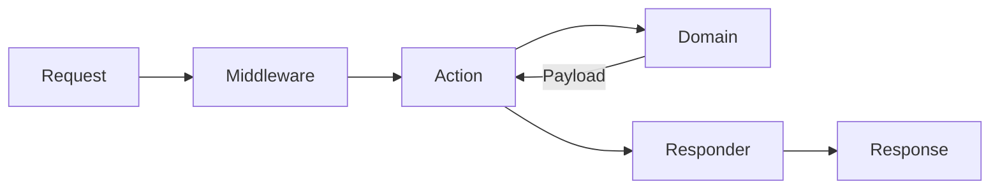

# Architecture

Vökuró ADR is built on the [Action-Domain-Responder](https://pmjones.io/adr/) pattern, arranged as ports and adapters. The delivery ring holds no `Phalcon\Di\DiInterface`: collaborators are constructor-injected, and the container exists only to wire them.

## The request flow



`AppFront` boots a container, the router maps the path to an action, the global and route middleware run, the action calls a domain and hands the returned payload to a responder, and the responder produces the response.

## Action

`src/Action` - one class per route, each implementing `Phalcon\Contracts\ADR\Action` with a single `__invoke(AttributeRequest)`. An action is thin: it reads the request, calls a domain, and hands the payload to a responder. It carries no business rules.

The responder an action **type-hints** is how it chooses a layout. A public page asks for the `AuthResponder` or a plain `ViewResponder`; a management page asks for the `PrivateResponder`. The action never names a layout string.

```php
final class GetAbout implements Action
{
    public function __construct(private ViewResponder $responder)
    {
    }

    public function __invoke(AttributeRequest $request): ResponseInterface
    {
        return ($this->responder->withTemplate('about/index'))(
            $request,
            new Response(),
            Payload::success()
        );
    }
}
```

## Domain

`src/Domain` - the use cases (`Session\Login`, `Session\SignUp`, `Users\CreateUser`, ...) together with the entities, value objects, and typed collections they work with. A domain takes a `Phalcon\ADR\Input\Input`, does its work through ports, and returns a payload. It knows nothing about HTTP, and it is where the rules that a form used to declare now live (required fields, password length, uniqueness).

Entities and value objects are readonly (`Domain\Model\User`, `Profile`, ...). Collections extend `Phalcon\Support\Collection` and are keyed by id (`Domain\Collection\UserCollection`).

## Responder

`src/Responder` - turns a payload into a response. It is mechanical: no decision about *what* happened, only how to present it.

| Responder | Produces |
| --- | --- |
| `ViewResponder` (framework) | HTML from a template, status from the payload |
| `AuthResponder` | the same, in the authentication layout |
| `PrivateResponder` | the same, in the management (sidebar) layout |
| `RedirectResponder` (framework) | a `302` to a `Redirect` result |
| `ErrorPageResponder` | the error page for a browser, JSON for an API client |

`AuthResponder` and `PrivateResponder` each wrap one `ViewResponder` bound to their layout - a renderer knows a single layout, so the layout an action wants is declared by which responder it asks for. See [payload.md](payload.md) for how a payload becomes a response.

## Ports and adapters

Everything the actions and domains depend on is a **port** - a small interface in `src/Contracts`. The adapters that implement them are split by responsibility:

* **`src/Application`** - policy and orchestration, no framework: `Acl` (the resource/action map), `Authorizer` (grants per profile), `RememberMe` (the cookie sign-in).
* **`src/Infrastructure`** - technology-bound adapters:
  * `Repository/*` - the eight repositories over `Phalcon\DataMapper` (`Connection` + `QueryFactory`), returning domain objects.
  * `Mail\Mailer` - Symfony Mailer behind the `Mailer` port; the transport is injected so it is unit-testable.
  * `Http\Cookies` - cookies over the PHP runtime.
  * `Http\Csrf` - CSRF over `Phalcon\Encryption\Security` (see below).
  * `View\LayoutRenderer` - wraps a template in a layout; `ProfileSelectData` feeds the `TagFactory` select helper.

The ports:

| Port (`src/Contracts`) | Adapter |
| --- | --- |
| `Repository\*` (8) | `Infrastructure\Repository\*` |
| `Mailer` | `Infrastructure\Mail\Mailer` |
| `Cookies` | `Infrastructure\Http\Cookies` |
| `Csrf` | `Infrastructure\Http\Csrf` |
| `Authorization` | `Application\Authorizer` |

Domains depend only on the ports, so the storage or transport behind them can change without a domain noticing - and tests swap in the in-memory fakes under `tests/Support/Fake`.

## Middleware

`src/Middleware` runs around the action. `RememberMeLogin` is global (it signs a returning visitor in from the cookie before anything else); `RequireLogin` and `RequirePermission` guard the `Users`, `Profiles`, and `Permissions` routes. Each implements `Phalcon\Contracts\ADR\Middleware` and receives the next handler.

## CSRF

CSRF sits behind the `Csrf` port (`token()` for views, `check(request)` for actions), with the adapter wrapping the injected `Security`. This keeps the `'csrf'` field name and the token dance out of the actions and views: a form renders `$csrf->token()`, and the action asks `$this->csrf->check($request)`. It works without a container because `Security` is given the session and request directly.

## The composition root

`src/AppFront.php` extends `Phalcon\ADR\Front\AbstractHttpFront`. It builds a `Phalcon\Container\Container`, loads the environment, and registers the providers (the services above, the session, logger, and renderers). Its `getApplication()` override builds the `Phalcon\ADR\Application`, sets the router's base namespace with `setBaseNamespace()`, and attaches the route guards with `secureWith()` - `RequireLogin` and `RequirePermission` on the `Users`, `Profiles`, and `Permissions` namespaces. The framework then matches the route, runs the middleware and action, and emits the response.

Two deliberate choices:

* **`Phalcon\DataMapper`, not `Mvc\Model`.** The ORM resolves its services through a `Phalcon\Di\DiInterface` an ADR application does not have; the data mapper needs no container.
* **`.phtml` templates, not Volt.** Registering a view engine requires a `DiInterface`, so the views are plain PHP. Templates receive `tag` (the `TagFactory`), `url`, and `csrf` as variables rather than reaching into a container.
