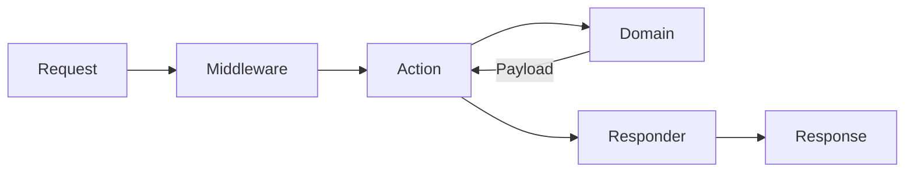

# Architecture

Vökuró ADR is built on the [Action-Domain-Responder](https://pmjones.io/adr/) pattern, arranged as ports and adapters. The delivery ring holds no `Phalcon\Di\DiInterface`: collaborators are constructor-injected, and the container exists only to wire them.

## The request flow


```mermaid
flowchart LR
    R[Request] --> M[Middleware]
    M --> A[Action]
    A --> D[Domain]
    D -- Payload --> A
    A --> P[Responder]
    P --> Resp[Response]
```

`AppFront` boots a container, the router maps the path to an action, the global and route middleware run, the action calls a domain and hands the returned payload to a responder, and the responder produces the response.

## Routing

There is no route table, no compile step, and no cache. The router derives one class from the method and the path, and derives the path back from the class:

* every static path segment is a namespace segment under `Vokuro\Action`;
* the class name is the HTTP verb followed by all of those segments concatenated;
* whatever the path has left over becomes a route attribute.

| Request | Action | Attributes |
| --- | --- | --- |
| `GET /` | `Action\Get` | |
| `GET /users` | `Action\Users\GetUsers` | |
| `GET /users/search` | `Action\Users\Search\GetUsersSearch` | |
| `POST /users/edit/3` | `Action\Users\Edit\PostUsersEdit` | `id` = `3` |
| `GET /confirm/AbC123/a@b.dev` | `Action\Confirm\GetConfirm` | `code`, `email` |

One path names exactly one class, and that class names exactly one path. Nothing can be shadowed, and adding or deleting an action can never move another one's URL. The cost is that **arguments always trail the static path** - `/users/edit/3`, never `/users/3/edit`.

Because directories are what tell the router where the static path ends, the namespace and the filesystem have to agree. `AppFront` hands it both halves:

```php
(new Application($container))
    ->setBaseNamespace('Vokuro\\Action')
    ->setActionDirectory($this->projectRoot . '/src/Action')
```

A segment with no matching directory ends the static path and becomes an attribute instead, so the directory layout under `src/Action` is load-bearing: it mirrors the URLs exactly, one directory per segment.

Words inside a segment are separated by `-` by default, applied symmetrically in both directions: `Users\ChangePassword\GetUsersChangePassword` reverses to `/users/change-password`. The camelCase links the views use (`/users/changePassword`) resolve to the same class, since both spellings camelize to `ChangePassword`.

### Route attributes

Trailing segments arrive as positional request attributes. An action that declares a static `params()` gets them checked, cast, converted, and **named** before it is invoked:

```php
final class GetUsersEdit implements Action
{
    public function __invoke(AttributeRequest $request): ResponseInterface
    {
        $user = $this->users->findById($request->getAttributes()->get('id', 0));
        // ...
    }

    public static function params(): array
    {
        return [
            'id' => ['type' => 'int', 'match' => '\d+'],
        ];
    }
}
```

Declaration order maps to segment order, and each entry takes up to three keys:

| Key | Effect |
| --- | --- |
| `match` | regex the whole segment must satisfy; a miss is a `404` raised before the action is built |
| `type` | `int`, `float`, or `string` (the default) |
| `convert` | any callable, applied after the cast |

So `GET /users/edit/abc` never reaches `GetUsersEdit` - it is a `404`, not a lookup for user `0`. The eight actions that take arguments (`Users\Edit`, `Users\Delete`, `Profiles\Edit`, `Profiles\Delete`, `Confirm`, `ResetPassword`) declare `params()`; every other action has no trailing segments and declares nothing.

`params()` never affects **which** class matches - it constrains, casts and converts after the match, so a wrong declaration is a validation bug, never a missing route. It does feed reverse routing: `pathFor(GetUsersEdit::class)` answers `/users/edit/{id}`, and `pathFor(GetConfirm::class)` answers `/confirm/{code}/{email}`.

## Action

`src/Action` - one class per route, each implementing `Phalcon\Contracts\ADR\Action` with a single `__invoke(AttributeRequest)`, and a static `params()` when the route takes arguments. An action is thin: it reads the request, calls a domain, and hands the payload to a responder. It carries no business rules.

The responder an action **type-hints** is how it chooses a layout. A public page asks for the `AuthResponder` or a plain `ViewResponder`; a management page asks for the `PrivateResponder`. The action never names a layout string.

```php
final class GetAbout implements Action
{
    public function __construct(private ViewResponder $responder)
    {
    }

    public function __invoke(AttributeRequest $request): ResponseInterface
    {
        return ($this->responder->withTemplate('about/index'))(
            $request,
            new Response(),
            Payload::success()
        );
    }
}
```

## Domain

`src/Domain` - the use cases (`Session\Login`, `Session\SignUp`, `Users\CreateUser`, ...) together with the entities, value objects, and typed collections they work with. A domain takes a `Phalcon\ADR\Input\Input`, does its work through ports, and returns a payload. It knows nothing about HTTP, and it is where the rules that a form used to declare now live (required fields, password length, uniqueness).

Entities and value objects are readonly (`Domain\Model\User`, `Profile`, ...). Collections extend `Phalcon\Support\Collection` and are keyed by id (`Domain\Collection\UserCollection`).

## Responder

`src/Responder` - turns a payload into a response. It is mechanical: no decision about *what* happened, only how to present it.

| Responder | Produces |
| --- | --- |
| `ViewResponder` (framework) | HTML from a template, status from the payload |
| `AuthResponder` | the same, in the authentication layout |
| `PrivateResponder` | the same, in the management (sidebar) layout |
| `RedirectResponder` (framework) | a `302` to a `Redirect` result |
| `ErrorPageResponder` | the error page for a browser, JSON for an API client |

`AuthResponder` and `PrivateResponder` each wrap one `ViewResponder` bound to their layout - a renderer knows a single layout, so the layout an action wants is declared by which responder it asks for. See [payload.md](payload.md) for how a payload becomes a response.

## Ports and adapters

Everything the actions and domains depend on is a **port** - a small interface in `src/Contracts`. The adapters that implement them are split by responsibility:

* **`src/Application`** - policy and orchestration, no framework: `Acl` (the resource/action map), `Authorizer` (grants per profile), `RememberMe` (the cookie sign-in).
* **`src/Infrastructure`** - technology-bound adapters:
  * `Repository/*` - the eight repositories over `Phalcon\DataMapper` (`Connection` + `QueryFactory`), returning domain objects.
  * `Mail\Mailer` - Symfony Mailer behind the `Mailer` port; the transport is injected so it is unit-testable.
  * `Http\Cookies` - cookies over the PHP runtime.
  * `Http\Csrf` - CSRF over `Phalcon\Encryption\Security` (see below).
  * `View\LayoutRenderer` - wraps a template in a layout; `ProfileSelectData` feeds the `TagFactory` select helper.

The ports:

| Port (`src/Contracts`) | Adapter |
| --- | --- |
| `Repository\*` (8) | `Infrastructure\Repository\*` |
| `Mailer` | `Infrastructure\Mail\Mailer` |
| `Cookies` | `Infrastructure\Http\Cookies` |
| `Csrf` | `Infrastructure\Http\Csrf` |
| `Authorization` | `Application\Authorizer` |

Domains depend only on the ports, so the storage or transport behind them can change without a domain noticing - and tests swap in the in-memory fakes under `tests/Support/Fake`.

## Middleware

`src/Middleware` runs around the action. `RememberMeLogin` is global (it signs a returning visitor in from the cookie before anything else); `RequireLogin` and `RequirePermission` guard the `Users`, `Profiles`, and `Permissions` routes. Each implements `Phalcon\Contracts\ADR\Middleware` and receives the next handler.

## CSRF

CSRF sits behind the `Csrf` port (`token()` for views, `check(request)` for actions), with the adapter wrapping the injected `Security`. This keeps the `'csrf'` field name and the token dance out of the actions and views: a form renders `$csrf->token()`, and the action asks `$this->csrf->check($request)`. It works without a container because `Security` is given the session and request directly.

## The composition root

`src/AppFront.php` extends `Phalcon\ADR\Front\AbstractHttpFront`. It builds a `Phalcon\Container\Container`, loads the environment, and registers the providers (the services above, the session, logger, and renderers). Its `getApplication()` override builds the `Phalcon\ADR\Application`, points the router at the actions with `setBaseNamespace()` and `setActionDirectory()` (see [Routing](#routing)), and attaches the route guards with `secureWith()` - `RequireLogin` and `RequirePermission` on the `Users`, `Profiles`, and `Permissions` namespaces. Guards are matched by namespace prefix, so they cover everything nested below, `Users\Edit\PostUsersEdit` included. The framework then matches the route, runs the middleware and action, and emits the response.

Two deliberate choices:

* **`Phalcon\DataMapper`, not `Mvc\Model`.** The ORM resolves its services through a `Phalcon\Di\DiInterface` an ADR application does not have; the data mapper needs no container.
* **`.phtml` templates, not Volt.** Registering a view engine requires a `DiInterface`, so the views are plain PHP. Templates receive `tag` (the `TagFactory`), `url`, and `csrf` as variables rather than reaching into a container.
